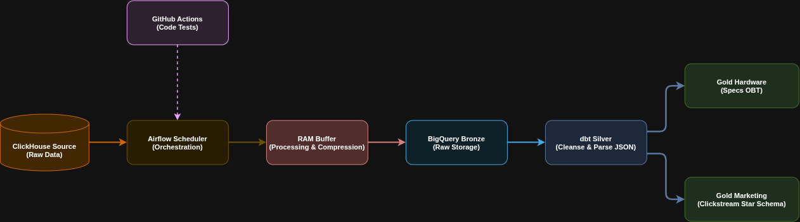
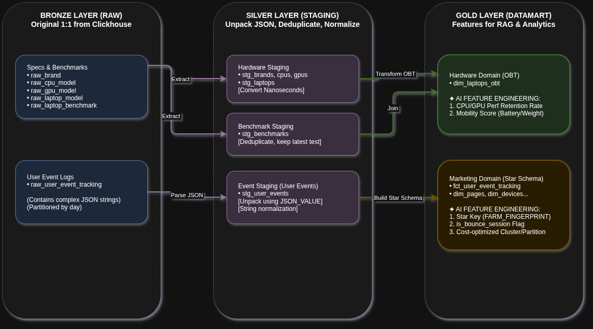
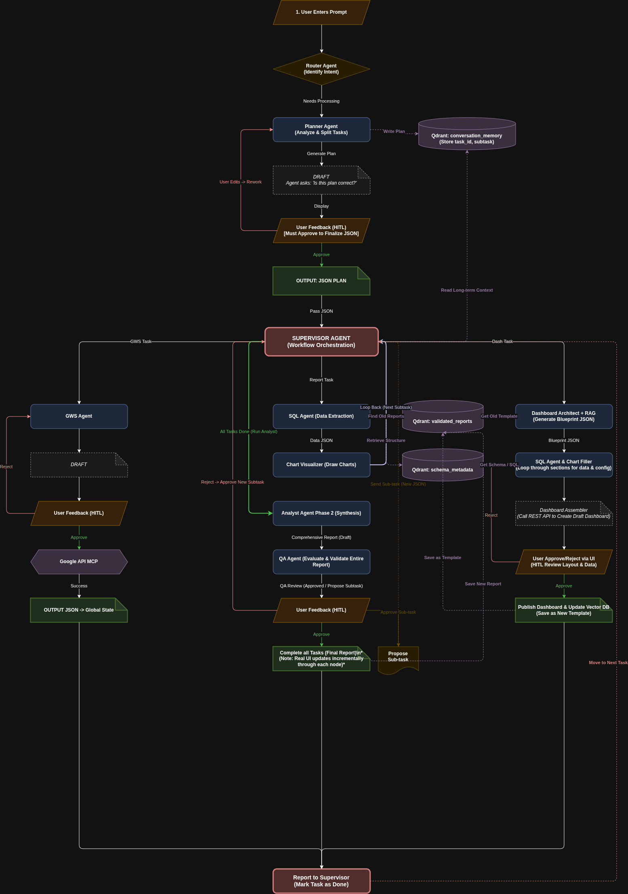
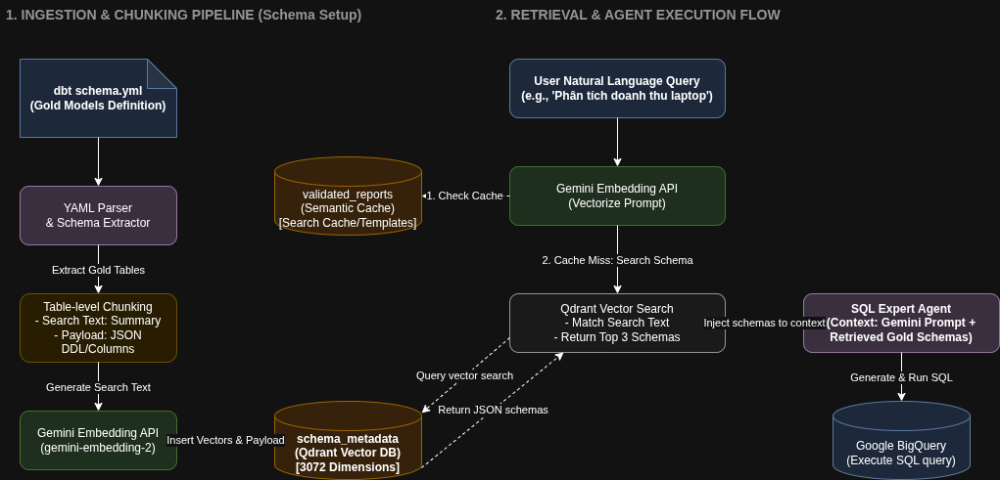

# AI RISSER - LapLapTech Enterprise Data Platform & Agentic Ecosystem

[](https://www.python.org/)
[](https://github.com/langchain-ai/langgraph)
[](https://ai.google.dev/)
[](https://qdrant.tech/)
[](https://cloud.google.com/bigquery)
[](https://reactjs.org/)

---

## 1. Project Overview & Mission

**AI RISSER** is a comprehensive data warehouse and multi-agent AI ecosystem developed for **LapLapTech**. 

It orchestrates the entire data lifecycle: from raw ClickHouse extraction to BigQuery Medallion transformations, and leverages a LangGraph-powered multi-agent system to automate business intelligence, semantic search, and dynamic dashboard generation via Apache Superset.

By translating natural language into complex analytical workflows, AI RISSER bridges the gap between non-technical stakeholders and enterprise data infrastructure.

---

## 2. Overall System Architecture

This diagram illustrates the high-level infrastructure for the ecosystem. It showcases how raw data from the ClickHouse source is orchestrated by Airflow, processed in-memory (RAM buffer) to avoid GCS storage costs, and loaded into BigQuery Medallion architecture (Bronze -> Silver -> Gold). GitHub Actions serves as the CI/CD gatekeeper for code quality.



---

## 3. Phase 1: Data Engineering & Data Marts (Completed)
This phase established the foundational data warehouse and automated orchestration for the AI RISSER ecosystem, successfully implementing a Hybrid Local Workflow.

### 3.1. Datamart Building Flow (Silver to Gold)
This diagram details the internal data modeling logic using `dbt`. It explains how complex JSON fields in the Bronze layer are unpacked and normalized in the Silver layer, and then joined to form the highly optimized Gold data marts featuring AI-ready metrics.



### 3.2. Technical Achievements

*   **Bronze Ingestion Layer (Raw Data Architecture):**
    *   **Orchestration Pipeline:** Successfully established the Airflow DAG `clickhouse_to_bigquery_bronze`, scheduled to run daily at 01:00 AM UTC.
    *   **Direct RAM Ingestion ($0 Storage):** Extracted data from the partner's ClickHouse server (`applog.xomdata.com`), compressed it into Parquet format (Snappy compression) directly in-memory (RAM) via `pyarrow`, and streamed it straight to BigQuery. This completely bypassed GCS staging, achieving a $0 storage cost architecture.
    *   **Large Data Management:** Processed the `user_event_tracking` log table (>750,000 rows) using a daily Incremental Load strategy, partitioned by `event_date`, and utilized Batch Load methods to safely bypass GCP free-tier limitations while maintaining audit logs.
    *   **Raw Tables Landed (`laplaptech_raw`):** 
        - `raw_brand` (20 rows)
        - `raw_cpu_model` (86 rows)
        - `raw_gpu_model` (56 rows)
        - `raw_laptop_model` (156 rows)
        - `raw_laptop_benchmark_result` (152 rows)
        - `raw_user_event_tracking` (Growing at ~1,000 rows/day)
        - `audit_pipeline_logs` (For pipeline run auditing)

*   **Silver & Gold Layers (dbt Data Modeling):**
    *   All dbt models were successfully compiled and executed on BigQuery (`dbt run` achieved a perfect `PASS=11` status).
    *   **Silver Staging Layer (`laplaptech_staging`):**
        *   **JSON Parsing:** Unpacked complex string data from `event_data` and `device` into explicit attribute fields (`url`, `referrer`, `os_name`, `device_type`, etc.).
        *   **Deduplication:** Cleaned benchmark tests by removing duplicates for the same laptop, retaining only the latest record based on update time.
        *   **Time Standardization:** Synchronized all ClickHouse nanosecond timestamps to the standard BigQuery timestamp format.
    *   **Gold Data Marts (Domain Separation):**
        *   **Domain 1: Hardware (`laplaptech_hardware`)**: Created the **`dim_laptops_obt`** (One Big Table) combining all configurations, CPU, GPU, and Benchmarks. Pre-calculated 4 derived ML-ready metrics: `cpu_single_battery_retention_pct`, `cpu_multi_battery_retention_pct`, `gpu_compute_battery_retention_pct`, and a custom `mobility_score`.
        *   **Domain 2: Marketing (`laplaptech_marketing`)**: Built the **`fct_user_event_tracking`** fact table, partitioned by `event_date` and clustered by `event_name, laptop_model_id` to drastically optimize SQL query costs for the AI Agent. Created dimensions like **`dim_pages`** (hashed using `FARM_FINGERPRINT` for `page_key`), **`dim_devices`**, and **`dim_sessions`** (calculating duration and `is_bounce_session` flags).

*   **Orchestration & CI/CD Automation:**
    *   **Airflow + dbt Integration:** Successfully added the `dbt_run_transformations` task (via `BashOperator`) to the end of the Airflow DAG, automatically triggering dbt transformations immediately after raw data ingestion succeeds.
    *   **CI/CD Infrastructure (`.github/workflows/ci.yml`):** Integrated GitHub Actions to automatically test DAG syntax (`DagBag` test) and dbt compilation (`dbt compile`) upon pushes/PRs to the `main` branch, protecting the codebase.
    *   **Git Status:** Maintained a clean codebase with a logical dbt models/macros folder structure, completely free of emojis/icons, and safely committed to `main`.

---

## 4. Phase 2: Agent Core & Hybrid RAG (Completed)
This phase successfully built the "brain" of the ecosystem (Agent Core) and the visual data analysis system (Superset).

### 4.1. Agent Workflow (Tri-Collection Agent Ecosystem)
This diagram illustrates the complete Phase 2 & 3 Agent Core logic. The system uses a Master Planner to break down user intent into JSON subtasks. The Supervisor orchestrates execution across three specialized branches (GWS, Reporting, and Dashboards) featuring automated loops, Human-in-the-Loop (HITL) gates, and bidirectional Vector DB contextual memory.



### 4.2. Hybrid RAG Ingestion & Retrieval Flow
This diagram details the Ingestion, Chunking, and Retrieval mechanism of our Agent RAG architecture:
1. **Ingestion & Chunking Pipeline:** Reads dbt schema definitions (`schema.yml`), parses them, and chunks them at the table level (generating table summaries and full column definitions). These chunks are vectorized using Gemini (`gemini-embedding-2`) and stored in the `schema_metadata` collection in Qdrant.
2. **Retrieval & Agent Execution:** When a query is received, the prompt vector searches `schema_metadata` to retrieve the top 3 most relevant table schemas, injecting them into the SQL Expert Agent context for error-free SQL generation on BigQuery. It also checks `validated_reports` for semantic caching.



### 4.3. Technical Achievements
*   **Agent Core (The Intelligence Heart):**
    *   **LangGraph Architecture:** Perfected 2 primary processing branches: **Report Flow** (data analysis and report generation) and **Dashboard Flow** (automated design and chart creation on Superset).
    *   **FastAPI Interface:** Successfully transitioned the Agent Core from a Terminal CLI to a RESTful API interface (`POST /run`), ready to serve any frontend connection.
    *   **Cloud Run Deployment:** Containerized the Docker image and successfully deployed to Google Cloud Run (`https://airisser-agent-core-598635008208.asia-southeast1.run.app`), ensuring auto-scaling and cost efficiency.
    *   **Checkpointer Configuration:** Fully resolved the passing of `thread_id` to LangGraph's `MemorySaver` to preserve multi-thread conversational context within the API environment.

*   **Hybrid RAG (Augmented Retrieval):**
    *   Successfully integrated **Qdrant Vector Database** to manage 2 primary RAG streams:
        1. **Schema Metadata RAG:** Enables the LLM to thoroughly understand the structure of BigQuery tables (like `dim_laptops_obt`, `fct_user_event_tracking`) to automatically generate 100% accurate SQL.
        2. **Semantic Cache RAG:** Stores and reuses previously generated Blueprints and charts to save tokens and significantly reduce response times.

*   **Apache Superset (Visualization Layer):**
    *   Successfully integrated and configured Superset to allow dashboard embedding (iframes).
    *   Deployed the system to Google Cloud Run (`https://airisser-superset-598635008208.asia-southeast1.run.app`).

---

## 5. Phase 3: Business Applications & Enterprise UI (In Progress)
With the AI Backend 100% "Live" and operating stably on GCP, Phase 2 is officially closed, leading directly into Phase 3 (Business Application UI & Integration).
*   **Premium Frontend Upgrade:** Pivoted from the planned Streamlit app to a **React (Vite) + Tailwind CSS** frontend, aiming for a high-end, premium standard for the Business Analytics Console.
*   **Real-time Streaming:** Implementing Server-Sent Events (SSE) so users can watch the AI Agents "think", write code, and query databases in real-time.
*   **Programmatic SEO Automation:** Developing autonomous agents that query `fct_user_event_tracking` for highly co-viewed laptops to dynamically generate and publish "VS" comparison landing pages embedded with JSON-LD schema.

---

## 6. Tech Stack

- **Data Engineering:** Apache Airflow, dbt Core, Google BigQuery.
- **AI & Orchestration:** Python 3.11, FastAPI, LangGraph, Google Gemini API, FastMCP.
- **Vector Search:** Qdrant.
- **Frontend:** React 18, Vite, Tailwind CSS.
- **BI & Visualization:** Apache Superset, Plotly.
- **Deployment:** Docker, Google Cloud Run, GitHub Actions.

---

## 7. Step-by-Step Installation Guide (Local Development)

Follow these steps to set up the AI RISSER ecosystem on your local machine.

### Prerequisites
- **Python 3.11+**
- **Node.js 18+**
- **Docker & Docker Compose**
- **Google Cloud Platform account** (with BigQuery access and a Service Account JSON key)
- **Gemini API Key** (from Google AI Studio)

### Step 1: Clone the Repository
```bash
git clone https://github.com/your-org/ai-risser.git
cd "AI RISSER"
```

### Step 2: Environment Configuration
Create a `.env` file in the root directory and populate it with your credentials:
```env
# AI Models
GEMINI_API_KEY=your_gemini_api_key_here

# Google Cloud & BigQuery
GCP_PROJECT_ID=your_gcp_project_id
GOOGLE_APPLICATION_CREDENTIALS=/absolute/path/to/your/service-account.json

# Qdrant Vector DB
QDRANT_HOST=localhost
QDRANT_PORT=6333
QDRANT_API_KEY=

# Apache Superset (Optional - for Dashboard Suite)
SUPERSET_URL=http://localhost:8088
SUPERSET_USERNAME=admin
SUPERSET_PASSWORD=admin
```

### Step 3: Start Infrastructure (Qdrant & Superset)
Ensure Docker daemon is running, then spin up the required databases:
```bash
docker-compose up -d
```

### Step 4: Python Backend Setup
```bash
# Create and activate virtual environment
python3 -m venv .venv
source .venv/bin/activate  # On Windows use: .venv\Scripts\activate

# Install backend dependencies
pip install -r requirements.txt

# Ingest BigQuery schema into Qdrant RAG (Run once)
python -m agent_core.ingest_schema

# Start FastAPI backend server
export PYTHONPATH=$(pwd)
python -m uvicorn agent_core.api:app --reload --port 8001
```
*The backend API will be available at `http://localhost:8001/docs`.*

### Step 5: React Frontend Setup
Open a **new terminal window** and navigate to the frontend directory:
```bash
cd frontend
npm install
npm run dev
```
*Navigate to `http://localhost:5173` in your browser to interact with the AI RISSER platform.*

### Step 6: (Optional) Run Data Pipelines
If you are developing the ELT pipelines and need to ingest fresh data:
```bash
# Start Airflow via Astro CLI
cd airflow
astro dev start

# Run dbt transformations
cd dbt
dbt run
```

---

## 8. License & Maintenance
Developed for **LapLapTech Data Engineering & AI Ecosystem**.
For questions, bug reports, or feature contributions, please contact the AI RISSER platform engineering team.

