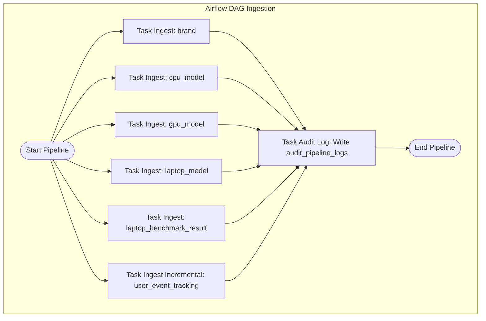

# Kế hoạch triển khai Bronze Layer Ingestion Stack - AI RISSER

Tài liệu này chi tiết hóa thiết kế kỹ thuật và kế hoạch thực thi để kéo 6 bảng dữ liệu từ ClickHouse (`applog.xomdata.com`) về tầng **Bronze Layer (`laplaptech_raw`)** trên GCP BigQuery thông qua Apache Airflow.

## Mục tiêu (Goal)
Tự động hóa hoàn toàn quy trình kéo dữ liệu thô (Ingestion Pipeline) cục bộ và nạp trực tiếp lên GCP BigQuery mà không lưu tệp tạm xuống ổ đĩa (0 disk write, nén Parquet in-memory).

---

## Phân tích Chiến lược Nạp (Ingestion Strategy)

Dựa trên khối lượng và đặc thù dữ liệu từ ClickHouse đối tác, chúng ta chia 6 bảng mục tiêu thành 2 nhóm chiến lược nạp riêng biệt:

### Nhóm 1: Full Refresh (Nạp đè toàn bộ)
* **Các bảng áp dụng**: `brand` (20 dòng), `cpu_model` (86 dòng), `gpu_model` (56 dòng), `laptop_model` (156 dòng), `laptop_benchmark_result` (152 dòng).
* **Đặc điểm**: Số lượng dòng dữ liệu rất ít (dưới 10,000 dòng). 
* **Cơ chế**: Mỗi lần chạy pipeline, hệ thống sẽ xóa sạch dữ liệu cũ ở bảng thô BigQuery và nạp lại toàn bộ dữ liệu mới nhất từ ClickHouse để đảm bảo tính nhất quán cao nhất và đơn giản hóa logic.

### Nhóm 2: Incremental Load (Nạp tăng trưởng theo ngày)
* **Bảng áp dụng**: `user_event_tracking` (khoảng 755,822 dòng từ 14/01/2025 đến nay, tăng trưởng trung bình ~1,000 dòng/ngày).
* **Đặc điểm**: Dung lượng lớn, phát sinh liên tục theo thời gian.
* **Cơ chế**: 
  - Airflow sẽ chạy hàng ngày lúc `01:00 AM UTC` để kéo dữ liệu của ngày hôm trước (sử dụng thời gian nhận trên server: `event_received_on_server_timestamp`).
  - Lọc dữ liệu thô trong ClickHouse theo mốc thời gian: `toDate(event_received_on_server_timestamp) = '{{ ds }}'` (sử dụng Airflow template `{{ ds }}` là ngày thực thi).
  - Sử dụng chế độ `WRITE_APPEND` trên BigQuery để ghi thêm dữ liệu mới vào bảng.
  - Bảng thô `laplaptech_raw.raw_user_event_tracking` trên BigQuery sẽ được **Phân vùng (Partition) theo Ngày** dựa trên cột `event_date` (sinh ra trong quá trình nạp bằng cách convert timestamp) để tối ưu chi phí quét dữ liệu của dbt ở tầng Silver/Gold sau này.

---

## Proposed Changes



### 1. Ingestion Script & DAG
Chúng ta sẽ viết trực tiếp mã nguồn Python Ingestion tích hợp bên trong file DAG của Airflow tại `./airflow/dags/ingest_dag.py`. File này sẽ tự động đọc cấu hình GCP Service Account thông qua biến môi trường `GOOGLE_APPLICATION_CREDENTIALS` đã thiết lập trong Docker Compose.

#### [MODIFY] airflow/ingest_dag.py
Thay thế tệp tin DAG trống bằng mã nguồn tự động hóa kéo dữ liệu chuẩn:

```python
import io
import json
import logging
from datetime import datetime, timedelta
import pandas as pd
import pyarrow as pa
import pyarrow.parquet as pq
import clickhouse_connect
from google.cloud import bigquery

from airflow import DAG
from airflow.operators.python import PythonOperator

# Khởi tạo logger
logger = logging.getLogger(__name__)

# Cấu hình kết nối ClickHouse
CH_HOST = "applog.xomdata.com"
CH_PORT = 80
CH_USER = "xomdata"
CH_PASS = "Vyljk8uhGfkR25vuocmNaJ1wJjtJ6920EANi0JkU"
CH_DB = "laplaptech"

# Cấu hình BigQuery Destination
BQ_PROJECT = "ai-riser-505908"
BQ_RAW_DATASET = "laplaptech_raw"

# Danh sách 5 bảng danh mục (Full Refresh)
FULL_REFRESH_TABLES = [
    "brand",
    "cpu_model",
    "gpu_model",
    "laptop_model",
    "laptop_benchmark_result"
]

def get_clickhouse_client():
    return clickhouse_connect.get_client(
        host=CH_HOST,
        port=CH_PORT,
        username=CH_USER,
        password=CH_PASS
    )

def log_audit_record(table_name, row_count, compressed_bytes, duration, status, error_msg=""):
    """Ghi log kiểm toán (audit log) vào BigQuery"""
    bq_client = bigquery.Client()
    audit_table_ref = f"{BQ_PROJECT}.{BQ_RAW_DATASET}.audit_pipeline_logs"
    
    # Schema của bảng audit
    schema = [
        bigquery.SchemaField("table_name", "STRING", mode="REQUIRED"),
        bigquery.SchemaField("row_count", "INTEGER", mode="REQUIRED"),
        bigquery.SchemaField("compressed_bytes", "INTEGER", mode="REQUIRED"),
        bigquery.SchemaField("duration_seconds", "FLOAT", mode="REQUIRED"),
        bigquery.SchemaField("status", "STRING", mode="REQUIRED"),
        bigquery.SchemaField("error_message", "STRING", mode="NULLABLE"),
        bigquery.SchemaField("elton_created_at", "TIMESTAMP", mode="REQUIRED"),
    ]
    
    # Tạo bảng nếu chưa tồn tại
    try:
        bq_client.get_table(audit_table_ref)
    except Exception:
        table = bigquery.Table(audit_table_ref, schema=schema)
        bq_client.create_table(table)
        logger.info(f"Created audit table {audit_table_ref}")
        
    row_to_insert = [{
        "table_name": table_name,
        "row_count": int(row_count),
        "compressed_bytes": int(compressed_bytes),
        "duration_seconds": float(duration),
        "status": status,
        "error_message": error_msg if error_msg else None,
        "elton_created_at": datetime.utcnow().isoformat()
    }]
    
    bq_client.insert_rows_json(audit_table_ref, row_to_insert)

def ingest_full_refresh_table(table_name, **kwargs):
    """Kéo và nạp lại toàn bộ (Full Refresh) một bảng danh mục"""
    start_time = datetime.now()
    ch_client = get_clickhouse_client()
    bq_client = bigquery.Client()
    
    try:
        logger.info(f"Starting Ingest (Full Refresh): {table_name}")
        
        # 1. Kéo dữ liệu từ ClickHouse thành Pandas DataFrame
        df = ch_client.query_df(f"SELECT * FROM `{CH_DB}`.`{table_name}`")
        row_count = len(df)
        
        # 2. Convert sang Parquet in memory sử dụng PyArrow
        table = pa.Table.from_pandas(df)
        buf = io.BytesIO()
        pq.write_table(table, buf, compression="SNAPPY")
        parquet_data = buf.getvalue()
        compressed_bytes = len(parquet_data)
        
        # 3. Nạp lên BigQuery thô (Ghi đè - WRITE_TRUNCATE)
        table_ref = f"{BQ_PROJECT}.{BQ_RAW_DATASET}.raw_{table_name}"
        job_config = bigquery.LoadJobConfig(
            source_format=bigquery.SourceFormat.PARQUET,
            write_disposition=bigquery.WriteDisposition.WRITE_TRUNCATE,
        )
        
        load_job = bq_client.load_table_from_file(
            io.BytesIO(parquet_data),
            table_ref,
            job_config=job_config
        )
        load_job.result()  # Chờ job hoàn tất
        
        duration = (datetime.now() - start_time).total_seconds()
        logger.info(f"Ingested {row_count} rows for raw_{table_name} in {duration}s")
        
        # Ghi vết kiểm toán thành công
        log_audit_record(table_name, row_count, compressed_bytes, duration, "SUCCESS")
        
    except Exception as e:
        duration = (datetime.now() - start_time).total_seconds()
        logger.error(f"Failed to ingest {table_name}: {str(e)}")
        log_audit_record(table_name, 0, 0, duration, "FAILED", str(e))
        raise e

def ingest_incremental_tracking(ds, **kwargs):
    """Kéo dữ liệu tracking theo ngày (Incremental)"""
    start_time = datetime.now()
    ch_client = get_clickhouse_client()
    bq_client = bigquery.Client()
    
    try:
        # ds là biến Airflow biểu thị ngày chạy dưới định dạng YYYY-MM-DD
        logger.info(f"Starting Ingest (Incremental) for user_event_tracking on date: {ds}")
        
        # 1. Kéo dữ liệu ClickHouse của đúng ngày thực thi
        query = f"""
        SELECT *, toDate(event_received_on_server_timestamp) as event_date 
        FROM `{CH_DB}`.`user_event_tracking` 
        WHERE toDate(event_received_on_server_timestamp) = '{ds}'
        """
        df = ch_client.query_df(query)
        row_count = len(df)
        
        # Chuyển đổi an toàn cột event_date thành kiểu date string để BigQuery nhận diện làm cột phân vùng
        if row_count > 0:
            df["event_date"] = pd.to_datetime(df["event_date"]).dt.date
        
        # 2. Nén Parquet in memory
        table = pa.Table.from_pandas(df)
        buf = io.BytesIO()
        pq.write_table(table, buf, compression="SNAPPY")
        parquet_data = buf.getvalue()
        compressed_bytes = len(parquet_data)
        
        # 3. Nạp lên BigQuery thô (Ghi thêm - WRITE_APPEND) kèm phân vùng (Partitioning) theo ngày
        table_ref = f"{BQ_PROJECT}.{BQ_RAW_DATASET}.raw_user_event_tracking"
        
        job_config = bigquery.LoadJobConfig(
            source_format=bigquery.SourceFormat.PARQUET,
            write_disposition=bigquery.WriteDisposition.WRITE_APPEND,
            time_partitioning=bigquery.TimePartitioning(
                type_=bigquery.TimePartitioningType.DAY,
                field="event_date"
            )
        )
        
        load_job = bq_client.load_table_from_file(
            io.BytesIO(parquet_data),
            table_ref,
            job_config=job_config
        )
        load_job.result()
        
        duration = (datetime.now() - start_time).total_seconds()
        logger.info(f"Ingested {row_count} rows for raw_user_event_tracking on {ds} in {duration}s")
        
        log_audit_record("user_event_tracking", row_count, compressed_bytes, duration, "SUCCESS")
        
    except Exception as e:
        duration = (datetime.now() - start_time).total_seconds()
        logger.error(f"Failed to ingest user_event_tracking on {ds}: {str(e)}")
        log_audit_record("user_event_tracking", 0, 0, duration, "FAILED", str(e))
        raise e


# Định nghĩa DAG Airflow
default_args = {
    "owner": "airflow",
    "depends_on_past": False,
    "email_on_failure": False,
    "email_on_retry": False,
    "retries": 1,
    "retry_delay": timedelta(minutes=5),
}

with DAG(
    "clickhouse_to_bigquery_bronze",
    default_args=default_args,
    description="Pipeline kéo dữ liệu từ ClickHouse sang GCP BigQuery Bronze Dataset",
    schedule_interval="0 1 * * *",  # Chạy hàng ngày lúc 01:00 AM UTC
    start_date=datetime(2025, 1, 14), # Bắt đầu từ mốc thời gian nhỏ nhất của dữ liệu tracking
    catchup=False, # Không chạy bù dồn dập, sẽ trigger tay hoặc kiểm tra cụ thể
    max_active_runs=1,
    tags=["bronze", "ingestion", "laplaptech"]
) as dag:

    # 1. Các Tasks Full Refresh
    tasks_full_refresh = []
    for table in FULL_REFRESH_TABLES:
        task = PythonOperator(
            task_id=f"ingest_{table}",
            python_callable=ingest_full_refresh_table,
            op_kwargs={"table_name": table}
        )
        tasks_full_refresh.append(task)
        
    # 2. Task Incremental cho log tracking
    task_incremental_tracking = PythonOperator(
        task_id="ingest_user_event_tracking",
        python_callable=ingest_incremental_tracking,
        # Trích xuất macro execution_date từ Airflow context truyền vào hàm ds
        op_kwargs={"ds": "{{ ds }}"}
    )
```

---

## Verification Plan

### Automated Tests
1. **Kiểm tra cú pháp code Python và cấu trúc DAG**:
   ```bash
   docker-compose exec -T airflow-scheduler python3 -c "from airflow.models import DagBag; db = DagBag(dag_folder='/opt/airflow/dags'); print('DAGs loaded:', db.dags.keys()); print('Errors:', db.import_errors)"
   ```
   *Kết quả mong đợi: `clickhouse_to_bigquery_bronze` xuất hiện trong danh sách và không có errors.*

2. **Chạy thử đơn lẻ (Dry Run) một Task Full Refresh**:
   ```bash
   docker-compose exec -T airflow-scheduler airflow tasks test clickhouse_to_bigquery_bronze ingest_brand 2026-08-19
   ```

3. **Chạy thử đơn lẻ (Dry Run) Task Incremental Tracking**:
   ```bash
   docker-compose exec -T airflow-scheduler airflow tasks test clickhouse_to_bigquery_bronze ingest_user_event_tracking 2026-08-19
   ```

### Manual Verification
1. Truy cập Airflow Webserver tại `http://localhost:8080`, kiểm tra DAG `clickhouse_to_bigquery_bronze` hiển thị chính xác.
2. Trigger DAG chạy để xem tiến trình Tasks hoàn thành (chuyển màu xanh).
3. Sử dụng Google Cloud Console hoặc python script để kiểm tra các bảng thô (`raw_brand`, `raw_cpu_model`,..., `raw_user_event_tracking`) và bảng kiểm toán `audit_pipeline_logs` được tạo chính xác trên GCP BigQuery.
