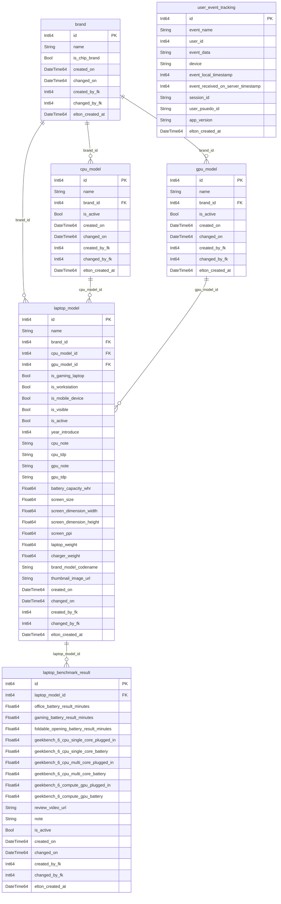

# Database Schema — `laplaptech` (ClickHouse)

> **Source:** ClickHouse Server `applog.xomdata.com`  
> **Database:** `laplaptech`  
> **Phân tích:** Schema được trích xuất tự động từ `system.columns` và sample data.

---

## Danh sách bảng

| # | Bảng | Mô tả |
|---|------|--------|
| 1 | [`brand`](#1-brand) | Danh mục thương hiệu (laptop, chip CPU/GPU) |
| 2 | [`cpu_model`](#2-cpu_model) | Danh mục model CPU |
| 3 | [`gpu_model`](#3-gpu_model) | Danh mục model GPU |
| 4 | [`laptop_model`](#4-laptop_model) | Danh mục model laptop (thông số kỹ thuật) |
| 5 | [`laptop_benchmark_result`](#5-laptop_benchmark_result) | Kết quả benchmark thực tế của từng laptop |
| 6 | [`user_event_tracking`](#6-user_event_tracking) | Tracking hành vi người dùng trên website/app |


---

## Sơ đồ quan hệ giữa các bảng (ERD)



---

## Chi tiết từng bảng

---

### 1. `brand`

> **Mô tả:** Danh mục thương hiệu. Chứa cả thương hiệu laptop (Dell, Asus, HP…) lẫn thương hiệu chip (Intel, AMD, Nvidia…). Phân biệt qua cờ `is_chip_brand`.

| Column | Data Type | Mô tả |
|--------|-----------|-------|
| `id` | `Nullable(Int64)` | Primary key |
| `name` | `Nullable(String)` | Tên thương hiệu |
| `is_chip_brand` | `Nullable(Bool)` | `true` = thương hiệu chip (Intel, AMD…); `false` = thương hiệu laptop |
| `created_on` | `Nullable(DateTime64(3))` | Thời điểm tạo bản ghi (từ nguồn gốc) |
| `changed_on` | `Nullable(DateTime64(3))` | Thời điểm cập nhật bản ghi (từ nguồn gốc) |
| `created_by_fk` | `Nullable(Int64)` | FK → user đã tạo bản ghi |
| `changed_by_fk` | `Nullable(Int64)` | FK → user đã cập nhật bản ghi |
| `elton_created_at` | `Nullable(DateTime64(3))` | Thời điểm bản ghi được sync/load vào ClickHouse (Elton pipeline) |

**Quan hệ:**
- `brand.id` ← `cpu_model.brand_id`
- `brand.id` ← `gpu_model.brand_id`
- `brand.id` ← `laptop_model.brand_id`

---

### 2. `cpu_model`

> **Mô tả:** Danh mục model CPU. Mỗi CPU thuộc về một thương hiệu (Intel, AMD…) và có thể được gán cho nhiều model laptop.

| Column | Data Type | Mô tả |
|--------|-----------|-------|
| `id` | `Nullable(Int64)` | Primary key |
| `name` | `Nullable(String)` | Tên model CPU (vd: Intel Core Ultra 7 155H) |
| `brand_id` | `Nullable(Int64)` | FK → `brand.id` (thương hiệu chip) |
| `is_active` | `Nullable(Bool)` | Trạng thái hoạt động của CPU model |
| `created_on` | `Nullable(DateTime64(3))` | Thời điểm tạo bản ghi |
| `changed_on` | `Nullable(DateTime64(3))` | Thời điểm cập nhật bản ghi |
| `created_by_fk` | `Nullable(Int64)` | FK → user đã tạo |
| `changed_by_fk` | `Nullable(Int64)` | FK → user đã cập nhật |
| `elton_created_at` | `Nullable(DateTime64(3))` | Thời điểm sync vào ClickHouse |

**Quan hệ:**
- `cpu_model.brand_id` → `brand.id`
- `cpu_model.id` ← `laptop_model.cpu_model_id`

---

### 3. `gpu_model`

> **Mô tả:** Danh mục model GPU. Tương tự `cpu_model`, mỗi GPU thuộc về một thương hiệu (Nvidia, AMD, Intel…).

| Column | Data Type | Mô tả |
|--------|-----------|-------|
| `id` | `Nullable(Int64)` | Primary key |
| `name` | `Nullable(String)` | Tên model GPU (vd: Nvidia RTX 4060) |
| `brand_id` | `Nullable(Int64)` | FK → `brand.id` (thương hiệu GPU) |
| `is_active` | `Nullable(Bool)` | Trạng thái hoạt động của GPU model |
| `created_on` | `Nullable(DateTime64(3))` | Thời điểm tạo bản ghi |
| `changed_on` | `Nullable(DateTime64(3))` | Thời điểm cập nhật bản ghi |
| `created_by_fk` | `Nullable(Int64)` | FK → user đã tạo |
| `changed_by_fk` | `Nullable(Int64)` | FK → user đã cập nhật |
| `elton_created_at` | `Nullable(DateTime64(3))` | Thời điểm sync vào ClickHouse |

**Quan hệ:**
- `gpu_model.brand_id` → `brand.id`
- `gpu_model.id` ← `laptop_model.gpu_model_id`

---

### 4. `laptop_model`

> **Mô tả:** Bảng trung tâm — danh mục model laptop với đầy đủ thông số kỹ thuật. Kết nối với `brand`, `cpu_model`, `gpu_model` và là nguồn gốc cho dữ liệu benchmark.

| Column | Data Type | Mô tả |
|--------|-----------|-------|
| `id` | `Nullable(Int64)` | Primary key |
| `name` | `Nullable(String)` | Tên model laptop |
| `brand_id` | `Nullable(Int64)` | FK → `brand.id` |
| `cpu_model_id` | `Nullable(Int64)` | FK → `cpu_model.id` |
| `gpu_model_id` | `Nullable(Int64)` | FK → `gpu_model.id` |
| `is_gaming_laptop` | `Nullable(Bool)` | `true` nếu là laptop gaming |
| `is_workstation` | `Nullable(Bool)` | `true` nếu là workstation |
| `is_mobile_device` | `Nullable(Bool)` | `true` nếu là thiết bị di động (tablet/2-in-1) |
| `is_visible` | `Nullable(Bool)` | Hiển thị trên giao diện người dùng hay không |
| `is_active` | `Nullable(Bool)` | Trạng thái hoạt động |
| `year_introduce` | `Nullable(Int64)` | Năm ra mắt |
| `cpu_note` | `Nullable(String)` | Ghi chú về CPU (vd: cấu hình TDP tùy chỉnh) |
| `cpu_tdp` | `Nullable(String)` | TDP của CPU (Watt) |
| `gpu_note` | `Nullable(String)` | Ghi chú về GPU |
| `gpu_tdp` | `Nullable(String)` | TDP của GPU (Watt) |
| `battery_capacity_whr` | `Nullable(Float64)` | Dung lượng pin (Wh) |
| `screen_size` | `Nullable(Float64)` | Kích thước màn hình (inch) |
| `screen_dimension_width` | `Nullable(Float64)` | Chiều rộng màn hình (mm/px) |
| `screen_dimension_height` | `Nullable(Float64)` | Chiều cao màn hình (mm/px) |
| `screen_ppi` | `Nullable(Float64)` | Mật độ điểm ảnh (PPI) |
| `laptop_weight` | `Nullable(Float64)` | Trọng lượng máy (kg) |
| `charger_weight` | `Nullable(Float64)` | Trọng lượng sạc (kg) |
| `brand_model_codename` | `Nullable(String)` | Tên mã nội bộ của thương hiệu (vd: ZenBook S13) |
| `thumbnail_image_url` | `Nullable(String)` | URL ảnh thumbnail của máy |
| `created_on` | `Nullable(DateTime64(3))` | Thời điểm tạo bản ghi |
| `changed_on` | `Nullable(DateTime64(3))` | Thời điểm cập nhật bản ghi |
| `created_by_fk` | `Nullable(Int64)` | FK → user đã tạo |
| `changed_by_fk` | `Nullable(Int64)` | FK → user đã cập nhật |
| `elton_created_at` | `Nullable(DateTime64(3))` | Thời điểm sync vào ClickHouse |

**Quan hệ:**
- `laptop_model.brand_id` → `brand.id`
- `laptop_model.cpu_model_id` → `cpu_model.id`
- `laptop_model.gpu_model_id` → `gpu_model.id`
- `laptop_model.id` ← `laptop_benchmark_result.laptop_model_id`

---

### 5. `laptop_benchmark_result`

> **Mô tả:** Kết quả đo đạc thực tế (benchmark) của từng model laptop. Gồm điểm Geekbench 6 (CPU & GPU), thời lượng pin thực tế theo các kịch bản sử dụng khác nhau.

| Column | Data Type | Mô tả |
|--------|-----------|-------|
| `id` | `Nullable(Int64)` | Primary key |
| `laptop_model_id` | `Nullable(Int64)` | FK → `laptop_model.id` |
| `is_active` | `Nullable(Bool)` | Kết quả đang được sử dụng/hiển thị hay không |
| `note` | `Nullable(String)` | Ghi chú về điều kiện đo benchmark |
| `review_video_url` | `Nullable(String)` | URL video review/benchmark |
| **Pin thực tế** | | |
| `office_battery_result_minutes` | `Nullable(Float64)` | Thời lượng pin kịch bản văn phòng (phút) |
| `gaming_battery_result_minutes` | `Nullable(Float64)` | Thời lượng pin kịch bản gaming (phút) |
| `foldable_opening_battery_result_minutes` | `Nullable(Float64)` | Thời lượng pin kịch bản màn hình gập mở (phút) |
| **Geekbench 6 — CPU Single-core** | | |
| `geekbench_6_cpu_single_core_plugged_in` | `Nullable(Float64)` | Điểm single-core khi cắm sạc |
| `geekbench_6_cpu_single_core_battery` | `Nullable(Float64)` | Điểm single-core khi dùng pin |
| **Geekbench 6 — CPU Multi-core** | | |
| `geekbench_6_cpu_multi_core_plugged_in` | `Nullable(Float64)` | Điểm multi-core khi cắm sạc |
| `geekbench_6_cpu_multi_core_battery` | `Nullable(Float64)` | Điểm multi-core khi dùng pin |
| **Geekbench 6 — GPU Compute** | | |
| `geekbench_6_compute_gpu_plugged_in` | `Nullable(Float64)` | Điểm GPU compute khi cắm sạc |
| `geekbench_6_compute_gpu_battery` | `Nullable(Float64)` | Điểm GPU compute khi dùng pin |
| `created_on` | `Nullable(DateTime64(3))` | Thời điểm tạo bản ghi |
| `changed_on` | `Nullable(DateTime64(3))` | Thời điểm cập nhật bản ghi |
| `created_by_fk` | `Nullable(Int64)` | FK → user đã tạo |
| `changed_by_fk` | `Nullable(Int64)` | FK → user đã cập nhật |
| `elton_created_at` | `Nullable(DateTime64(3))` | Thời điểm sync vào ClickHouse |

**Quan hệ:**
- `laptop_benchmark_result.laptop_model_id` → `laptop_model.id`

---

### 6. `user_event_tracking`

> **Mô tả:** Bảng tracking hành vi người dùng trên website/app. Ghi lại các sự kiện (page view, click, search…) kèm thông tin thiết bị và session. Hai trường `event_data` và `device` chứa JSON.

| Column | Data Type | JSON? | Mô tả |
|--------|-----------|-------|-------|
| `id` | `Nullable(Int64)` | — | Primary key |
| `event_name` | `Nullable(String)` | — | Tên sự kiện (vd: `page_view`, `click_laptop`) |
| `user_id` | `Nullable(Int64)` | — | ID người dùng đã đăng nhập (null nếu ẩn danh) |
| `user_psuedo_id` | `Nullable(String)` | — | ID giả (anonymous ID / cookie ID) |
| `session_id` | `Nullable(String)` | — | ID phiên làm việc |
| `app_version` | `Nullable(String)` | — | Phiên bản app/website tại thời điểm ghi event |
| `event_local_timestamp` | `Nullable(Int64)` | — | Unix timestamp phía client (ms) |
| `event_received_on_server_timestamp` | `Nullable(Int64)` | — | Unix timestamp nhận tại server (ms) |
| `event_data` | `Nullable(String)` | Yes | Dữ liệu ngữ cảnh của event (JSON) |
| `device` | `Nullable(String)` | Yes | Thông tin thiết bị (JSON) |
| `elton_created_at` | `Nullable(DateTime64(3))` | — | Thời điểm sync vào ClickHouse |

#### JSON Schema — `event_data`
```json
{
  "page_name": "string",  // Tên trang hiện tại (vd: "laptop_detail", "home")
  "device_id":  "string", // ID của thiết bị (thường là UUID lưu ở Client)
  "url":        "string", // URL đầy đủ của trang xảy ra event
  "referrer":   "string"  // URL trang trước đó dẫn người dùng tới trang này
}
```

#### JSON Schema — `device`
```json
{
  "user_agent":    "string",        // Chuỗi User-Agent của trình duyệt/thiết bị
  "os_name":       "string",        // Tên hệ điều hành (vd: "Windows", "Android", "iOS")
  "os_version":    "string",        // Phiên bản hệ điều hành (vd: "10", "15.7")
  "device_brand":  "string | null", // Thương hiệu thiết bị (vd: "Apple", "Samsung")
  "device_name":   "string | null", // Tên thiết bị (vd: "iPhone 13")
  "device_type":   "string | null", // Loại thiết bị (vd: "mobile", "tablet", "desktop")
  "manufacturer":  "string | null", // Nhà sản xuất phần cứng
  "model_id":      "string | null", // Mã model của thiết bị
  "model_name":    "string | null"  // Tên model thương mại của thiết bị
}
```

---

## Ghi chú chung

| Pattern | Ý nghĩa |
|---------|---------|
| `created_on` / `changed_on` | Timestamp từ hệ thống nguồn (Superset/Django admin) |
| `created_by_fk` / `changed_by_fk` | FK tới bảng user ở hệ thống nguồn (chưa sync vào ClickHouse) |
| `elton_created_at` | Timestamp do pipeline Elton stamp khi sync dữ liệu vào ClickHouse |
| `is_active` | Soft delete — bản ghi không bị xóa vật lý mà chỉ bị đánh dấu inactive |
| `is_visible` | Kiểm soát hiển thị trên UI, độc lập với `is_active` |
