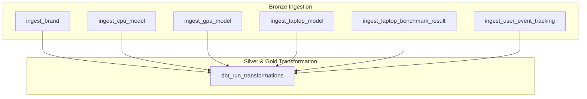

# Kế hoạch triển khai Step 4: Orchestration & Scheduling (Airflow + dbt)

Tài liệu này chi tiết hóa thiết kế kỹ thuật và kế hoạch thực thi để tích hợp các tác vụ dbt run trực tiếp vào Airflow DAG `clickhouse_to_bigquery_bronze`.

## Mục tiêu (Goal)
Tự động hóa hoàn toàn chuỗi pipeline:
1. Airflow kích hoạt lúc 01:00 AM UTC hàng ngày.
2. Thực thi đồng thời kéo 5 bảng danh mục (Full Refresh) và bảng log tracking (Incremental) từ ClickHouse về BigQuery Bronze layer.
3. **Trigger dbt Run**: Ngay sau khi toàn bộ dữ liệu thô (Bronze) được nạp thành công, Airflow sẽ gọi dbt biên dịch và chuyển đổi dữ liệu lên staging/marts (Silver & Gold layer).
4. Đảm bảo toàn bộ quy trình chạy khép kín trong container, ghi log kiểm toán đầy đủ.

---

## Thiết kế Tasks trong Airflow DAG

Chúng ta sử dụng `BashOperator` để chạy lệnh `dbt run` trực tiếp bên trong container của Airflow Scheduler (nơi đã được cấu hình và chạy thử dbt thành công ở các bước trước).

### Đồ thị phụ thuộc tác vụ (Task Dependency Graph)



---

## Proposed Changes

#### [MODIFY] airflow/dags/ingest_dag.py
Chúng ta bổ sung thêm thư viện `BashOperator` và tạo task `dbt_run_transformations` chạy ở cuối luồng DAG.

```python
# Import thêm BashOperator ở đầu file
from airflow.operators.bash import BashOperator

# ... giữ nguyên phần code python ingest cũ ...

with DAG(
    "clickhouse_to_bigquery_bronze",
    default_args=default_args,
    description="Pipeline kéo dữ liệu từ ClickHouse sang GCP BigQuery Bronze Dataset",
    schedule_interval="0 1 * * *",
    start_date=datetime(2025, 1, 14),
    catchup=False,
    max_active_runs=1,
    tags=["bronze", "ingestion", "laplaptech"]
) as dag:

    # 1. Các Tasks Full Refresh
    tasks_full_refresh = []
    for table in FULL_REFRESH_TABLES:
        task = PythonOperator(
            task_id=f"ingest_{table}",
            python_callable=ingest_full_refresh_table,
            op_kwargs={"table_name": table}
        )
        tasks_full_refresh.append(task)
        
    # 2. Task Incremental cho log tracking
    task_incremental_tracking = PythonOperator(
        task_id="ingest_user_event_tracking",
        python_callable=ingest_incremental_tracking,
        op_kwargs={"ds": "{{ ds }}"}
    )

    # 3. Task thực thi dbt transform
    task_dbt_run = BashOperator(
        task_id="dbt_run_transformations",
        bash_command=(
            "export PATH=/home/airflow/.local/bin:$PATH && "
            "dbt run --project-dir /opt/airflow/dbt --profiles-dir /opt/airflow/dbt"
        )
    )

    # Thiết lập luồng phụ thuộc (Dependencies)
    # Task dbt run chỉ chạy khi toàn bộ các tác vụ kéo dữ liệu thô hoàn thành thành công
    for t_refresh in tasks_full_refresh:
        t_refresh >> task_dbt_run
        
    task_incremental_tracking >> task_dbt_run
```

---

## Verification Plan

### Automated Tests
1. **Kiểm tra cú pháp DAG**:
   ```bash
   docker-compose exec -T airflow-scheduler python3 -c "from airflow.models import DagBag; db = DagBag(dag_folder='/opt/airflow/dags'); print('DAGs loaded:', db.dags.keys()); print('Errors:', db.import_errors)"
   ```
2. **Chạy thử tích hợp Task dbt trong Airflow (Dry Run)**:
   ```bash
   docker-compose exec -T airflow-scheduler airflow tasks test clickhouse_to_bigquery_bronze dbt_run_transformations 2026-08-19
   ```
   *Kết quả mong đợi: Task chạy bash command thành công, in ra stdout log của dbt chạy thành công.*

### Manual Verification
1. Kích hoạt (Trigger) DAG chạy hoàn chỉnh từ giao diện web Airflow.
2. Kiểm tra log của task `dbt_run_transformations` để chắc chắn luồng chuyển đổi được kích hoạt thành công sau khi nạp xong.
