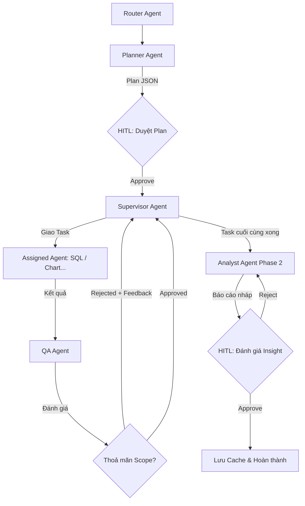
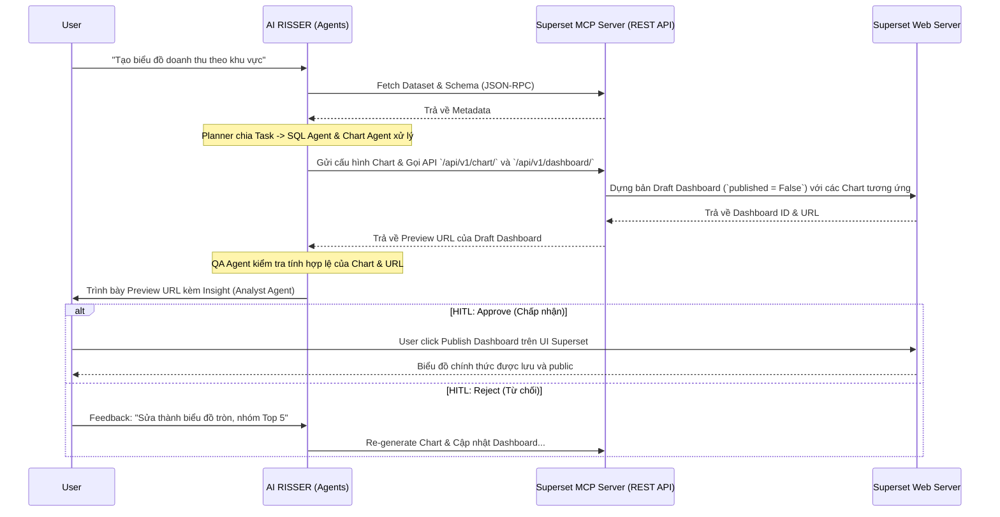

# KẾ HOẠCH THIẾT KẾ AGENT PIPELINE (LANGGRAPH & HITL)

## 1. Giới thiệu
Hệ thống sử dụng **LangGraph** để điều phối các luồng Agentic AI. Thay vì một con LLM làm tất cả (nhiều ảo giác), tác vụ được bẻ gãy thành nhiều bước xử lý tuần tự bởi các Agent chuyên biệt, hoạt động dưới sự giám sát của Supervisor Agent.

## 2. Kiến trúc Routing & Supervisor
- **Router Agent**: Tiếp nhận câu hỏi, phân loại ý định (Ví dụ: Chào hỏi, Cần dữ liệu, Cần Superset). Nếu là tác vụ Data, chuyển cho Planner.
- **Planner Agent**: Phân tách câu hỏi phức tạp thành Kế hoạch dạng chuỗi các Task/Subtask. Trình bày nháp ra UI chờ người dùng duyệt.
- **Supervisor Agent**: Cầm bản JSON kế hoạch đã duyệt, điều phối đẩy Task vào luồng xử lý tương ứng và thu thập kết quả.

## 3. Luồng Ad-Hoc Report với Dynamic ReAct QA Loop
Mô phỏng chân thực quy trình làm việc của phòng Khoa học dữ liệu với một vòng lặp liên tục để đảm bảo chất lượng:



1. **Phân giao Task (Supervisor)**: Dựa trên Kế hoạch (`plan_json`), Supervisor sẽ điều hướng (Route) Task hiện tại cho Agent phù hợp (Ví dụ: `sql_extractor`, `chart_visualizer`).
2. **Thực thi (Assigned Agent)**: Agent được chỉ định thực thi nhiệm vụ được giao (Ví dụ: SQL Agent sinh câu query và lấy dữ liệu).
3. **Kiểm duyệt (QA Agent)**: Mọi kết quả đầu ra đều phải được gửi qua **QA Agent** (Quality Assurance) trước khi hoàn tất.
   - QA Agent kiểm tra xem kết quả có thoả mãn `task scope` và `goal` ban đầu không.
   - Nếu **Thoả mãn (Approved)**: Báo cáo lại cho Supervisor để chuyển sang Task tiếp theo.
   - Nếu **Không thoả mãn (Rejected)**: QA Agent trả về `qa_feedback` (Góp ý/Chỉ trích lỗi sai), Supervisor sẽ ép Agent đó nhận Feedback và chạy lại từ đầu (ReAct Loop) cho đến khi đúng thì thôi.
4. **Báo cáo (Analyst Phase 2)**: Sau khi toàn bộ các Task đều qua ải QA, toàn bộ dữ liệu (Raw Data, Charts) được chuyển tới Analyst Phase 2 để rút ra Insight chuyên sâu.

## 4. Chốt chặn Human-In-The-Loop (HITL)
Đảm bảo con người luôn kiểm soát quá trình sinh mã và định hướng hệ thống.
- **Tại Planner Agent**: Tạm dừng luồng (`interrupt_before`), yêu cầu người dùng duyệt danh sách Task/Subtask (Plan). Người dùng có quyền Approve, Reject hoặc bổ sung thêm Subtask.
- **Tại Analyst Phase 2 (Report)**: Yêu cầu người dùng đánh giá Insight. Nếu sai hoặc cần thay đổi, có thể tiếp tục bổ sung ý kiến.
- **Đóng Task**: Báo cáo được người dùng "Approve" sẽ được tự động lưu vào Qdrant (`validated_reports` - Semantic Cache).

## 5. Các công cụ MCP (Model Context Protocol) tích hợp
- **Google API MCP**: Giao tiếp BigQuery, Google Docs.
- **Python Sandbox MCP**: Dùng để Chart Agent vẽ biểu đồ an toàn.
- **Superset MCP**: Sử dụng giao thức độc lập, hỗ trợ Preview-First Workflow.

### 5.1. Kiến trúc luồng tạo Báo cáo qua Superset MCP (Preview-First Workflow)
Quy trình này áp dụng tiêu chuẩn an toàn cao nhất, ngăn chặn AI trực tiếp thay đổi hoặc đẩy "rác" vào Database và Dashboard gốc.



## 6. Kiến trúc "Wireframe-First" kết hợp RAG (Retrieval-Augmented Generation)
Quy trình xây dựng Dashboard không chỉ tự nghĩ ra (Generate) mà sẽ kết hợp sức mạnh của RAG để học hỏi từ các báo cáo chuẩn mực đã có trong quá khứ, tối ưu hoá khả năng kể chuyện bằng dữ liệu (Data Storytelling).

1. **Dashboard Architect Agent (hoặc Planner) kết hợp RAG**: Phân tích yêu cầu và truy vấn Vector DB (Qdrant).
   - *Semantic RAG*: Tìm kiếm định nghĩa Metric/Dimension từ `schema_metadata`.
   - *Template RAG*: Tìm kiếm layout của các báo cáo tương tự đã từng được duyệt (từ `validated_reports`) để dùng làm mẫu.
   - Xuất ra `Dashboard Blueprint JSON` bao gồm Layout (Ví dụ: 3 dòng) và `Goal` cụ thể của từng section.
2. **Chart Visualizer Agent(s) (Truy xuất SQL RAG)**: Đọc Blueprint, có thể tiếp tục Query RAG để lấy các đoạn mã SQL mẫu. Sau đó lấy đúng `goal` của section được giao để viết SQL và vẽ Chart qua MCP. (Chạy song song nhiều Agent).
3. **Superset MCP**: Gom các Chart Preview lại và build lên bản nháp Dashboard theo đúng Grid Layout.

```mermaid
graph TD
    User([Người dùng]) -->|Yêu cầu Dashboard| Router[Router Agent]
    Router --> Architect[Dashboard Architect Agent]
    
    %% RAG Integration
    VectorDB[(Qdrant: Tri-Collection RAG)]
    VectorDB -.->|1. Truy xuất Schema & Metrics| Architect
    VectorDB -.->|2. Truy xuất Layout Mẫu (Template)| Architect
    
    Architect -->|Sinh Grid Layout & Goals| Blueprint[(Dashboard Blueprint JSON)]
    
    Blueprint -->|Row 1: KPI| Chart1[Chart Agent 1]
    Blueprint -->|Row 2: Trend| Chart2[Chart Agent 2]
    Blueprint -->|Row 3: Breakdown| Chart3[Chart Agent 3]
    
    VectorDB -.->|3. Truy xuất SQL Snippet| Chart1
    VectorDB -.->|3. Truy xuất SQL Snippet| Chart2
    VectorDB -.->|3. Truy xuất SQL Snippet| Chart3
    
    Chart1 -->|SQL & Chart Config| MCP[Superset MCP Server]
    Chart2 -->|SQL & Chart Config| MCP
    Chart3 -->|SQL & Chart Config| MCP
    
    MCP -->|Stitch together| Preview[Draft Dashboard Preview]
    Preview --> HITL{HITL Review Layout & Data}
    
    HITL -->|Approve| Save[Lưu Dashboard chính thức]
    HITL -->|Reject| Feedback[Quay lại sửa cụ thể từng Chart]
    Save -.->|Lưu ngược lại Template mới| VectorDB
```
