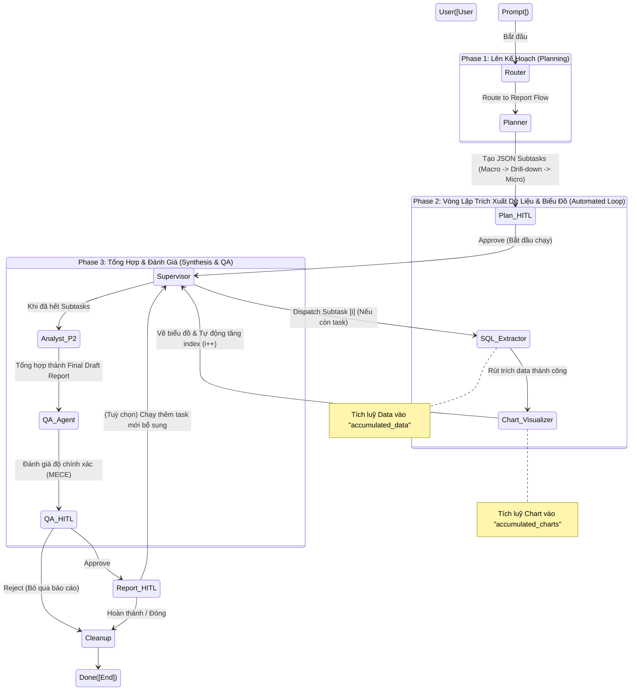

# Cập nhật luồng Report Flow (Luồng 2) với Multi-subtask Loop

Bản vẽ dưới đây mô tả chính xác luồng chạy mới nhất của **Report Flow** (Sau khi cập nhật chức năng tách tự động nhiều subtask và vòng lặp phân tích).

## 1. Biểu đồ luồng (StateGraph)

## 2. Giải thích chi tiết sự thay đổi

### Sự khác biệt so với phiên bản cũ (One-shot):
- **Bản cũ:** Planner tạo ra duy nhất 1 task ➡️ SQL lấy 1 data ➡️ Chart vẽ 1 hình ➡️ Analyst viết 1 báo cáo ➡️ QA đánh giá. Nếu thiếu ý, QA sẽ tạo thêm 1 task mới và lặp lại cực kỳ chậm và tốn bước HITL.
- **Bản mới:** Planner phân tích toàn cảnh và tạo ra **SẴN 1 danh sách nhiều Subtask** (Ví dụ: Task 1: Data tổng quan, Task 2: Data phân bổ, Task 3: Data chi tiết). 
  - Sau đó, hệ thống bước vào vòng lặp **Supervisor ➡️ SQL ➡️ Chart ➡️ Supervisor**. 
  - Vòng lặp này chạy ngầm và tự động trích xuất toàn bộ dữ liệu, tạo nhiều biểu đồ.
  - Mỗi khi một biểu đồ được vẽ xong (Chart_Visualizer), UI frontend sẽ stream và render ngay biểu đồ đó lên giao diện cho User xem trước.
  - Khi vòng lặp hoàn thành tất cả Subtask, **Analyst P2** mới xuất hiện, đọc TẤT CẢ data được gom lại và viết một Báo cáo phân tích (Markdown) tổng hợp hoàn hảo nhất.

### Lợi ích:
- **Tốc độ:** Các agent không phải hội ý sau mỗi một tác vụ nhỏ.
- **Trải nghiệm UI:** Người dùng thấy biểu đồ được render liên tục từng khối một (Stream từng node).
- **Chất lượng báo cáo:** Analyst có cái nhìn toàn cảnh (Macro, Drill-down, Micro) để đưa ra Business Intelligence tốt hơn.
